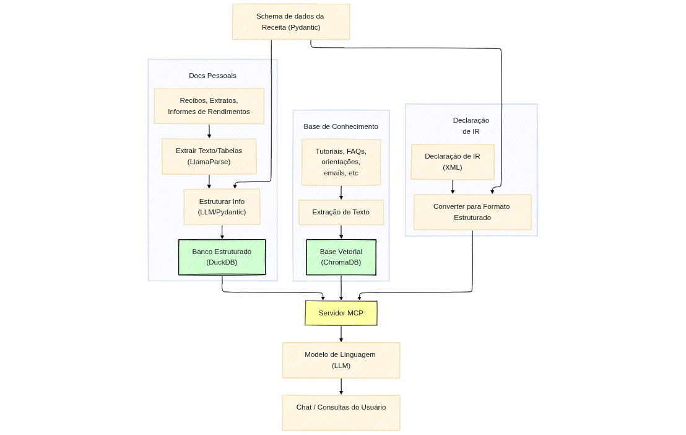

# IRPF_MCP: Assistente Inteligente para Declaração de Imposto de Renda

<p align="center">
  
  
  
  
</p>

IRPF_MCP é um assistente inteligente baseado em IA para auxiliar contribuintes brasileiros com sua declaração de Imposto de Renda de Pessoa Física (IRPF). O sistema utiliza tecnologias avançadas de processamento de linguagem natural e análise de documentos para facilitar o preenchimento, verificação e otimização da declaração de imposto.

## 🌟 Características

- **Integração com o programa oficial da Receita Federal**: Lê e interpreta arquivos XML da declaração do IRPF diretamente do programa oficial
- **Processamento de documentos financeiros**: Extrai automaticamente informações de PDFs de informes de rendimentos, notas fiscais e outros documentos relevantes
- **Base de conhecimento fiscal**: Acessa informações atualizadas sobre legislação tributária e regras do IRPF
- **Análise de dados financeiros**: Organiza e analisa rendimentos, despesas, bens e direitos para otimizar a declaração
- **Interface conversacional**: Responde a perguntas sobre o imposto de renda em linguagem natural

<p align="center">
  
</p>

## 🛠️ Tecnologias Utilizadas

- **FastMCP**: Framework para criação de assistentes inteligentes
- **LlamaIndex**: Para indexação e recuperação de informações da base de conhecimento
- **ChromaDB**: Banco de dados vetorial para armazenamento eficiente de embeddings
- **DuckDB**: Banco de dados analítico para processamento de dados financeiros
- **OpenAI**: Modelos de linguagem e embeddings para processamento de linguagem natural
- **LlamaParse**: Para extração precisa de informações de documentos PDF complexos

## 📋 Instalação e Configuração

### Pré-requisitos

- Sistema operacional Linux ou macOS (não compatível com Windows)
- Python 3.9 ou superior
- Ambiente virtual Python (recomendado)
- Acesso à API da OpenAI (para embeddings e consultas)

### Passos para Instalação

1. Clone o repositório:
   ```bash
   git clone https://github.com/seu-usuario/IRPF_MCP.git
   cd IRPF_MCP
   ```

2. Crie e ative um ambiente virtual:
   ```bash
   python -m venv .venv
   source .venv/bin/activate  # Linux/Mac
   ```

3. Instale as dependências:
   ```bash
   pip install -r requirements.txt
   ```

4. Configure o arquivo `setup.yaml` com suas informações pessoais (veja formatação abaixo).

5. Adicione seus documentos fiscais:
   - Coloque todos os documentos relacionados ao imposto de renda (informes de rendimentos, extratos bancários, notas fiscais, registros de bens, etc.) na pasta `meus_arquivos/originais`

6. Adicione fontes de conhecimento sobre imposto de renda:
   - Coloque qualquer material de referência sobre imposto de renda (livros, artigos, conversas com contadores, etc.) na pasta `knowledge_base/dados`

7. Execute o script de configuração:
   ```bash
   python setup.py
   ```

   > **IMPORTANTE**: O script `setup.py` deve ser executado durante a instalação inicial e sempre que houver novos arquivos nos diretórios de entrada. Este script inicializa a base de conhecimento, processa documentos pessoais e configura os bancos de dados necessários.

### Configuração do arquivo setup.yaml

O arquivo `setup.yaml` contém configurações essenciais para o funcionamento do sistema. Crie este arquivo na raiz do projeto com os seguintes parâmetros:

```yaml
# Chaves de API
# Se preferir, você pode salvar as chaves de API como variáveis do ambiente virtual.
openai_api_key: "sua-chave-da-openai"
llama_cloud_api_key: "sua-chave-do-llama-cloud"

# Informações pessoais
cpf: "seu-cpf"

# Caminhos de arquivos
xml_path: "/caminho/completo/para/seu/arquivo.xml" #o padrão é "ProgramasRFB/IRPF2025/aplicacao/dados/CPF/CPF-0000000000.xml"

# Configurações de banco de dados
database:
  path: "meus_arquivos/irpf.duckdb"
```

Substitua os valores acima pelos seus próprios dados. O arquivo XML pode ser exportado diretamente do programa oficial da Receita Federal.

### Configuração dos Clientes MCP

Para utilizar o IRPF_MCP com diferentes clientes de IA, você precisa adicionar a configuração do servidor MCP ao arquivo de configuração do cliente. O conteúdo do arquivo `irpf_mcp_client_config.json` deve ser copiado e colado no arquivo de configuração MCP do cliente que você deseja usar.

#### Exemplos de Arquivos de Configuração

**Cursor**
```
~/.cursor/mcp.json
```

**Windsurf**
```
~/.codeium/windsurf/mcp_config.json
```

**Claude Desktop**
```
~/Library/Application\ Support/Claude/claude_desktop_config.json
```

**Claude Code**
```
~/.claude.json
```

#### Instruções para Configuração

1. Abra o arquivo `irpf_mcp_client_config.json` deste projeto
2. Copie todo o conteúdo do arquivo
3. Abra o arquivo de configuração do cliente MCP que você deseja usar (veja exemplos acima)
4. Cole o conteúdo no arquivo de configuração, respeitando a estrutura JSON existente
5. Salve o arquivo

## 🚀 Uso

1. Certifique-se de que o script de configuração foi executado:
   ```bash
   python setup.py
   ```

2. Conecte-se ao servidor usando seu cliente MCP preferido (Cursor, Windsurf, Claude Desktop, etc.)

3. Comece a interagir com o assistente usando linguagem natural para obter ajuda com sua declaração de imposto de renda

## 📊 Escopo Atual

Este projeto é uma prova de conceito e atualmente tem funcionalidades limitadas, focando principalmente em:

- **Receitas**: Análise de rendimentos tributáveis, isentos e exclusivos
- **Impostos Pagos**: Verificação de impostos retidos na fonte e pagamentos efetuados
- **Bens e Direitos**: Análise de bens e direitos declarados

Outras áreas da declaração de imposto de renda, como despesas médicas, educação, dependentes, etc., ainda não são completamente suportadas nesta versão.

## 📁 Estrutura de Diretórios

- `knowledge_base/`: Base de conhecimento sobre legislação tributária e regras do IRPF
  - `dados/`: Coloque aqui fontes de informação sobre imposto de renda (livros, artigos, etc.)
- `meus_arquivos/`: Diretório para armazenar e processar documentos pessoais
  - `originais/`: Coloque seus PDFs de informes de rendimentos aqui
  - `data_files/`: Dados extraídos dos documentos
- `server.py`: Servidor MCP principal com inicialização integrada
- `server_minimal.py`: Versão simplificada do servidor MCP (requer execução prévia de setup.py)
- `setup.py`: Script de configuração e inicialização
- `irpf_mcp_client_config.json`: Configuração para clientes MCP
- `setup.yaml`: Arquivo de configuração com chaves de API e parâmetros pessoais

## 📄 Licença

Este projeto está licenciado sob a Licença MIT - veja o arquivo LICENSE para detalhes.


## ⚠️ Nota Importante

Este projeto é uma prova de conceito e atualmente foca apenas nos principais campos da declaração de imposto de renda: receitas, impostos pagos e bens. Não é uma análise completa da declaração de imposto de renda.


## ⚠️ Aviso Legal

Este software é fornecido apenas para fins educacionais e de assistência. Não substitui o aconselhamento profissional de contadores ou advogados tributários. Os usuários são responsáveis pela precisão de suas declarações de imposto de renda.

### ⚠️ Alerta de Privacidade

**IMPORTANTE**: Este aplicativo utiliza serviços de APIs externas (OpenAI e LlamaParse) para processamento de documentos e geração de respostas. Seus dados fiscais são enviados para esses serviços durante o processamento. Embora essas empresas tenham políticas de privacidade rigorosas, recomendamos:

- **Não utilizar** este aplicativo para documentos ou dados tributários ultra-sensíveis
- Considerar a remoção de informações pessoais identificáveis dos documentos antes do processamento
- Estar ciente de que dados transmitidos para serviços de terceiros estão sujeitos às políticas de privacidade desses serviços

Se você tem preocupações com a privacidade de dados fiscais sensíveis, considere consultar um profissional de impostos diretamente.

---

<p align="center">
  Desenvolvido com ❤️ para simplificar a vida dos contribuintes brasileiros
</p>
