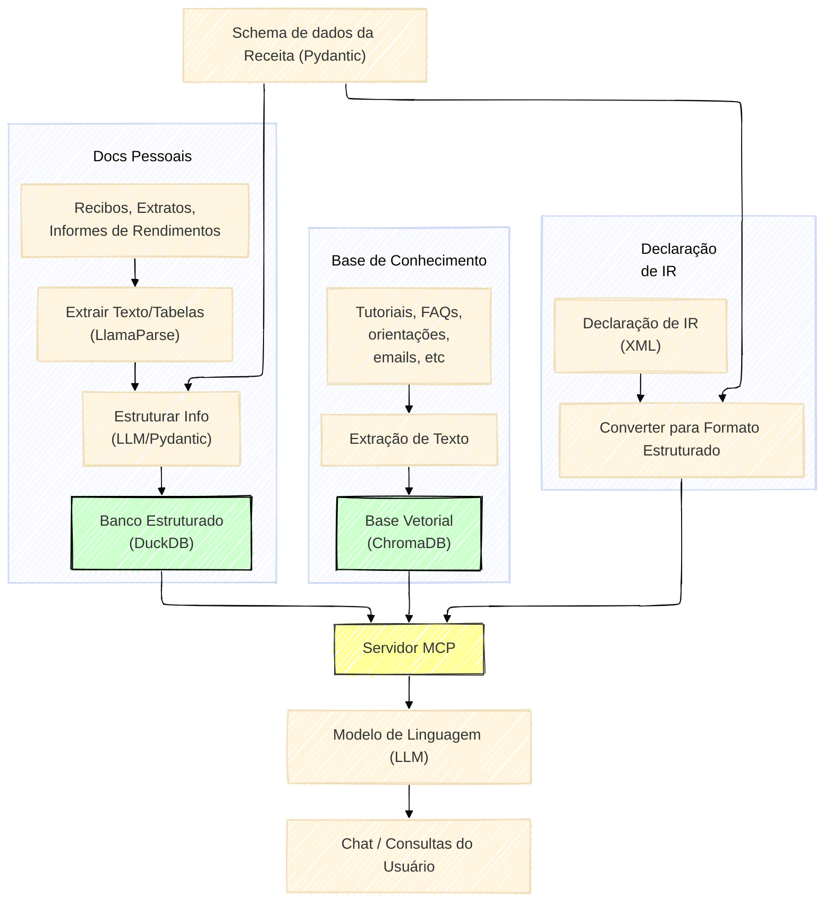

# AI Tax Agent Architecture

```mermaid
---
config:
    look: handDrawn
    theme: base
    layout: elk
---
flowchart TD
    subgraph Fluxo1["<br>Declaração<br>de IR"]
        A1["Declaração de IR<br>(XML)"]
        B1["Converter para Formato Estruturado"]
    end

    subgraph Fluxo2["<br>Base de Conhecimento"]
        A2["Tutoriais, FAQs,<br>orientações,<br>emails, etc"]
        B2["Extração de Texto"]
        C2["Base Vetorial<br>(ChromaDB)"]
    end

    subgraph Fluxo3["<br>Docs Pessoais"]
        A3["Recibos, Extratos,<br>Informes de Rendimentos"]
        B3["Extrair Texto/Tabelas<br>(LlamaParse)"]
        D3["Estruturar Info<br>(LLM/Pydantic)"]
        C3["Banco Estruturado<br>(DuckDB)"]
    end

    X1["Schema de dados da Receita (Pydantic)"]

    A1 --> B1
    X1 --------> B1
    X1 --------> D3
    B1 --> M["Servidor MCP"]
    A2 --> B2 --> C2 --> M
    A3 --> B3 --> D3 --> C3 --> M
    M --> L["Modelo de Linguagem (LLM)"]
    L --> Q["Chat / Consultas do Usuário"]

    style M fill:#ff9,stroke:#333,stroke-width:1px
    style C2 fill:#cfc,stroke:#000
    style C3 fill:#cfc,stroke:#000
```
